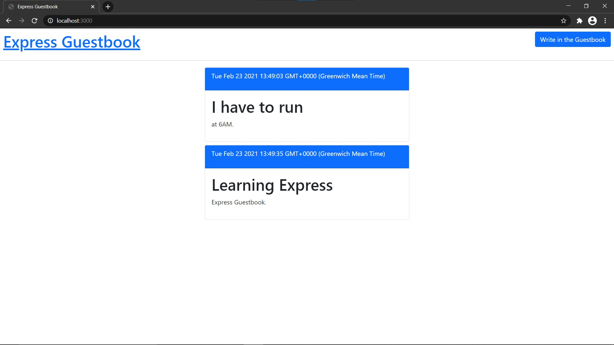

# Express Guestbook

This repo contains a simple example that you can use for testing.

## Getting started

### Prerequistes

1. git
2. Node: any 12.x version
3. Yarn
4. A fork of the repo (for any contributions)
5. clone of this repo on your local machine

### Instalation

1. `npm install` or `yarn`

### Runing localy
1. `npm run dev` or `yarn dev` 
2. `open http://localhost:3000` to open the site in your favorite browser

### Preview: 

